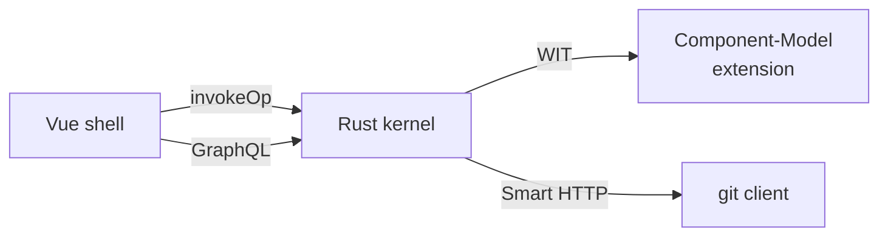

# Comtrya

Comtrya is a schema-first forge prototype. The current `v3` branch is a
production-testbed runtime built from:

- a Rust host in `crates/server`
- first-party Component Model extensions in `extensions/first-party`
- platform WIT in `extensions/wit/comtrya/platform`
- a Vite/Vue frontend in `frontend`
- pure-Rust Git upload-pack support in `crates/git-http`

## Run the production testbed

```sh
cp .envrc.example .envrc
./start.sh
```

For a clean end-to-end verification run:

```sh
./start.sh --reset --oneshot
```

The smoke path builds the server and frontend, checks the v3 structural cutover,
starts the stack, exercises Auth/GraphQL/events/extensions/Git/browser UI, and
proves issue close plus pull-request merge reactor flows through WASM.

## Architecture



The kernel projects every repo's `package comtrya` block to the JSON
api, which is what the CUE config viewer surfaces:

```d2
direction: right
cue: package comtrya
cuengine: cue evaluation
projection: JSON projection
viewer: /r/<path>/config

cue -> cuengine -> projection -> viewer
```

Product operations route through canonical WIT operation endpoints into
Wasmtime Component Model components. First-party extensions are authored as
Rust `cargo-component` crates and ship real artifacts at
`dist/<extension-id>.wasm`.

The Vue shell owns navigation, auth/session exchange, GraphQL transport, and UI
extension loading. Browser extension bundles are served from
`/_extensions/<id>/assets/...` and registered through the Comtrya SDK.

Git clone/fetch uses the pure-Rust Smart HTTP path. Git receive-pack/push and
full OIDC browser callback validation are intentionally unsupported in the
production testbed.

## Useful docs

- `ARCHITECTURE.md`: current runtime map.
- `DEMO_RUNBOOK.md`: local-demo operator commands and inspection paths.
- `docs/RUNBOOK.md`: production-class operator runbook (deploy, rollback, common failures, restore, key rotation, capacity signals).
- `PRODUCTION_TESTBED.md`: startup gates and production-testbed boundary.
- `docs/CONTAINER.md`: container image build/run mechanics.
- `docs/extensions.md`: extension authoring contract.
- `GOAL.md`: v3 completion status and invariants.
